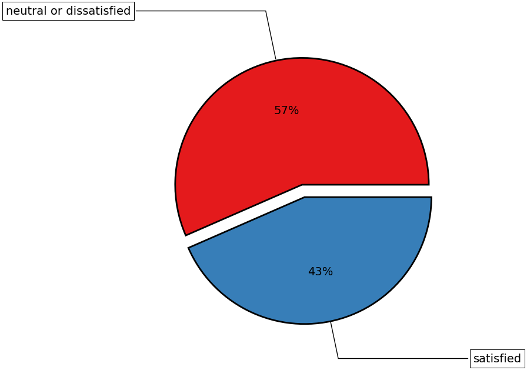
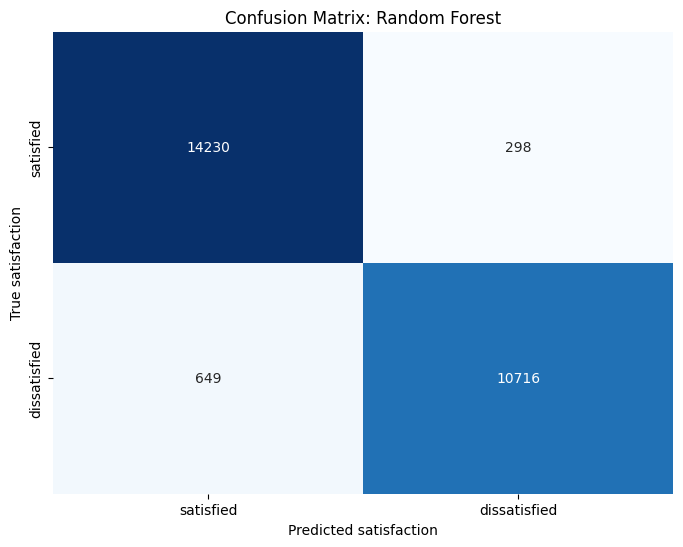
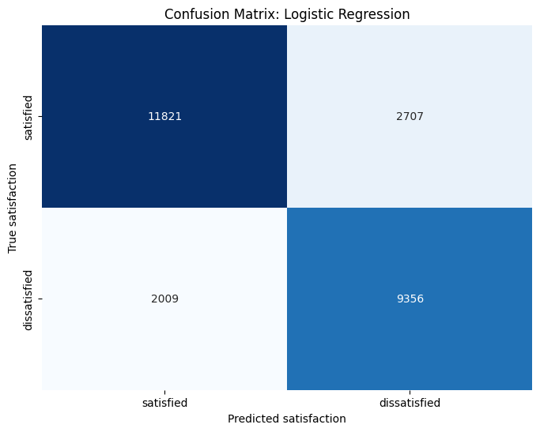
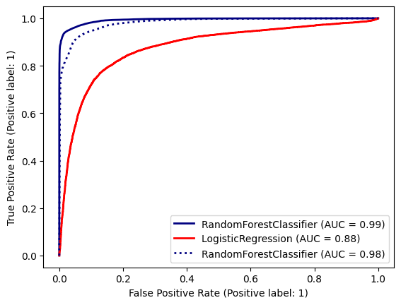
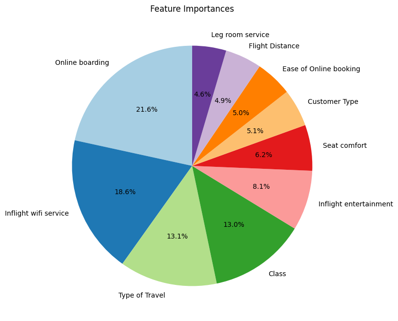

# Project 1 (Classification): Airline Passenger Satisfaction
## Overview
The data for this project was already divided into testing and training. However, in order to gain a better overview, they were combined. The table below provides an insight into the features available. Based on those features the passenger satisfaction was predicted which was either "satisfied" or "neutral or dissatisfied".

The pie-plot provides a very simple overview of the the percentage of satisfied and dissatisfied passanger. It becomes clear that the majority of the custommers is neutral or dissatisfied. In the initial phase, a random forest classifier and a logistic regression model will be trained. Following this, a feature selection process will be conducted, enabling the airline to identify and prioritize key features. This strategic approach allows the airline to focus on enhancing specific aspects of its service to drive passenger satisfaction.

<table align="center">
      <tr>
        <th>Feature</th>
        <th>Entries</th>
        <th>Mean</th>
      </tr>
      <tr>
        <td>Gender</td>
        <td>Female or Male</td>
         <td>NaN</td>
      </tr>
      <tr>
        <td>Customer Type</td>
        <td>Loyal Customer or Disloyal Customer</td>
        <td>NaN</td>
      </tr>
      <tr>
        <td>Age</td>
        <td>7-85</td>
        <td>39.43</td>
      </tr>
      <tr>
        <td>Type of Travel</td>
        <td>Business travel orPersonal Travel </td>
        <td>NaN</td>
      </tr>
      <tr>
        <td>Class</td>
        <td>Eco, Eco Plus or Buisiness</td>
        <td>NaN</td>
      </tr>
      <tr>
        <td>Flight Distance</td>
        <td>31-4983</td>
        <td>1190.21</td>
      </tr>
      <tr>
        <td>Inflight wifi service</td>
        <td>0-5</td>
        <td>2.73</td>
      </tr>
      <tr>
        <td>Departure/Arrival time convenient</td>
        <td>0-5</td>
        <td>3.05</td>
      </tr>
      <tr>
        <td>Ease of Online booking</td>
        <td>0-5</td>
        <td>2.76</td>
      </tr>
      <tr>
        <td>Gate location</td>
        <td>0-5</td>
        <td>2.98</td>
      </tr>
      <tr>
        <td>Food and drink</td>
        <td>0-5</td>
        <td>3.21</td>
      </tr>  
      <tr>
        <td>Online boarding</td>
        <td>0-5</td>
        <td>3.25</td>
      </tr>   
      <tr>
        <td>Seat comfort</td>
        <td>0-5</td>
        <td>3.44</td>
      </tr> 
        <tr>
        <td>Inflight entertainment</td>
        <td>0-5</td>
          <td>3.36</td>
      </tr> 
        <tr>
        <td>On-board service</td>
        <td>0-5</td>
        <td>3.38</td>
      </tr> 
        <tr>
        <td>Leg room service</td>
        <td>0-5</td>
        <td>3.35</td>
      </tr> 
        <tr>
        <td>Baggage handling</td>
        <td>1-5</td>
        <td>3.63</td>
      </tr> 
        <tr>
        <td>Checkin service</td>
        <td>0-5</td>
        <td>3.30</td>
      </tr> 
        <tr>
        <td>Inflight service</td>
        <td>0-5</td>
        <td>3.64</td>
      </tr> 
        <tr>
        <td>Cleanliness</td>
        <td>0-5</td>
        <td>3.29</td>
      </tr> 
        <tr>
        <td>Departure Delay in Minutes</td>
        <td>0-1592</td>
        <td>14.64</td>
      </tr> 
      </tr> 
        <tr>
        <td>Arrival Delay in Minutes</td>
        <td>0-1584</td>
        <td>15.09</td>
      </tr>   
</table>

  

<!-- Figure -->

  

## Model Training
Two models were trained in parallel and evaluated against each other, a random forest classifier and a logistic regression model. These models were selected as the classification task was binary i.e. satisfied or dissatisfied. However, before training the data several steps had to be undertaken which were encoding the features that were non numerical using LabelEncoder and scaling the data using StandardScaler. After completing these steps the models were trained.

### Random Forest Classifier

  

In a first instance a random forest classifier was trained 

  

  

### Logistic Regression 
 

  

### Model Evaluation

  

## Conclusion 

  

